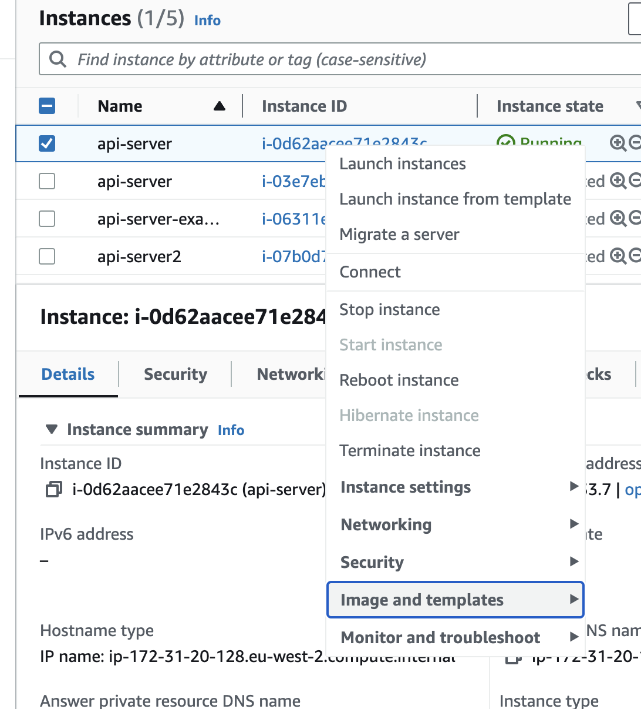

# Amazon machine images

## Introduction

This execise builds upon the [load balancing exercise](https://github.com/northcoders/ce-load-balancing-node-api) as you step up your automation skills.

When working through the load balancing exercise, you had to repeat a series of instructions in order to setup multiple EC2 instances. In summary you had to:

- SSH into the instance
- Run `sudo apt get update` to update the package repository
- Run `sudo apt install nodejs` and `sudo apt install npm` to install required software
- Run `git clone...` to get your code
- Run `sudo npm install pm2 -g`
- Run `pm2 start src/index.js` to start your application

For 2 instances it was probably fine but what if you wanted 10 instances or even 100 instances that could balance the load.

In this exercise you will create an Amazon Machine Image (AMI) of your server so you no longer have to repeat all those steps.

## Instructions

### 1. Creating an instance

In order to get things working you first need to create a template EC2 instance that is configured as per the requirements of the API.

Said another way you need to create an EC2 instance exactly like you did for the load balancing exercise

So go ahead now and create an EC2 instance by running through **steps 4 to 10** from the [load balancing exercise](https://github.com/northcoders/ce-load-balancing-node-api).

### 2. AMI Image creation

Once you have validated that your EC2 instance is setup properly, (you should test hitting the API via the public DNS for the instance) it is time to take a snapshot of it in the form of a machine image.

This essentially creates a template of the current state of the server such that you can use that template to create further identical instances of the server.

On the EC2 instance screen, **right click** the **Instance ID** and choose **Image and Templates** followed by **Create image**

(As shown in the image below)



Give your image a name and a description. The other settings can be left as default.

This will create your very own custom AMI

### 3. Create instance from AMI

Once your image has been created it will appear in the **AMIs** section within the **EC2** service

🗒️ Note: AMI images do take a few minutes to be created so double check the **Status** column on AMIs page before continuing

Once your image is **Available** go back to **EC2 Instances** and **Launch** a new instance

Give your instance a name then when you get to the **Application and OS Images** section, instead of using the **Quick start** images, choose the **My AMIs** tab and choose your newly created AMI

🗒️ Note: For those attempting things on command line, you can also see the AMI ID listed here if you need it.

Complete the remaining setup as per the guide in the load balancing article, selecting the correct security group and key pair.

### 4. SSH and verify

Your instance will now be created.

Let's SSH to the instance and verify things. Go ahead and SSH into your new instance

🗒️ Note: The AWS console might tell you to use the username **root** for logging into your instance such as `ssh -i "api-server-keypair.pem" root@ec2-13-41-188-137.eu-west-2.compute.amazonaws.com` - ignore this change the `root` username to be `ubuntu`.

Once you have logged in to your instance run a few commands to check things

Check that node is installed and you should see a response

```
node --version
```

Check that the code is in place and you should see the right directory

```
ls
```

Check that the API has started

```
curl localhost:3000
```

😔 Oh no it doesn't look like the app is started....go ahead and start it:

```
cd ce-load-balancing-node-api/app
```

then

```
pm2 start src/index.js
```

Now re-try seeing if the API has started

```
curl localhost:3000
```

You should see something like

```
curl localhost:3000/

{"message":"Hello cloud engineering crew"}
```

Well done on getting this far!! You can now spin up your own instances based upon a template with all the pre-loaded software required!

No more having to having to run installation steps every time you create an instance 🙌

### 5. User Data

Now that we have our template, we should be able to make new servers without issue right? Well there is one small issue.

When we make a template image it takes an image of what is stored on disk but NOT the running processes. IE the things running in memory. The AMI has no knowledge of applications having being started. However, we can fix this using a startup script!

One of those startup scripts could be to start up your API so that as soon as the AMI instance is started it launches the API

As a hint, take a look at [AWS Instance User Data](https://docs.aws.amazon.com/AWSEC2/latest/UserGuide/user-data.html)

You might find some sample user-data scripts in this repository 😉

Once you have worked it out, validate that your API successfully starts up without you having to go in and start it manually.

## Tearing things down

Make sure you terminate all running EC2 instances

## Submission process

1. Fork and clone this repository

2. Follow through the instructions above

3. Create a SOLUTION.md and populate it with answers to the following questions/actions

   - Take a screenshot of your AMI in the AWS console and add it to the SOLUTION.md
   - Take a screenshot of you running the verification commands on the instance that was created via your AMI and add it to the SOLUTION.md

4. Follow through the tearing things down steps above
