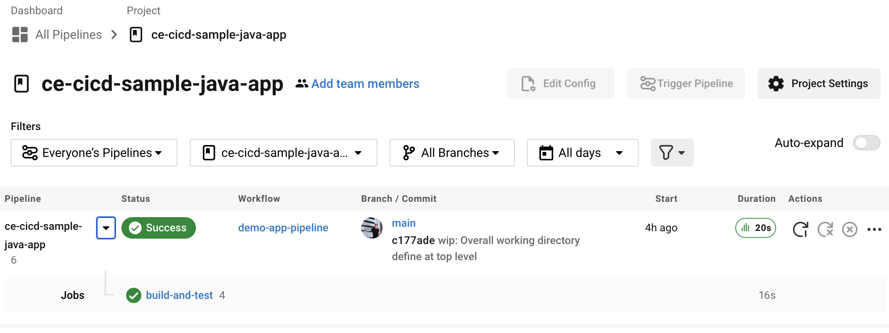
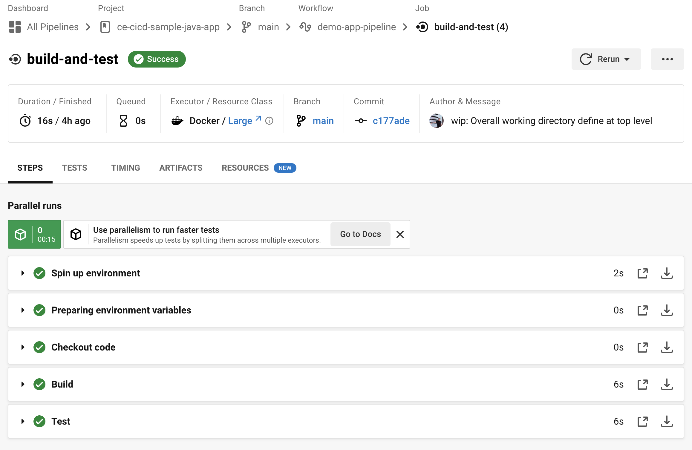
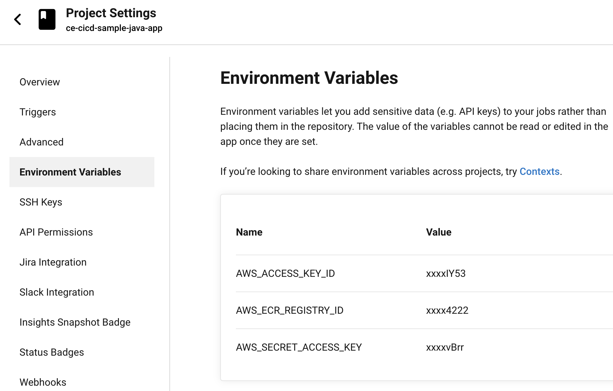

# Continuous integration

## Introduction

Another day, another development language - this time the development team you are supporting have created a Java [Spring Boot](https://spring.io/projects/spring-boot) based web application.

They've shared a Dockerfile and all the code with you in this repository. 

It's your job to explore the code, getting it running locally and then also create the build pipeline for this app.

At this stage you don't need to have the pipeline deploying the application but it should make sure to build, test, package and push the Docker image to your container registry.

You'll make use of the [CircleCI](https://circleci.com/) SaaS tool for defining and running your pipeline.

## Exercises

### Fork this repository

You will need to ensure you have the repository listed on your GitHub account so go ahead and fork this repository now if you have not yet done so.

### Getting app running locally

The developers have kindly left you a [Dockerfile](./demo-app/Dockerfile).

Explore the docker file and see if you can get the application running locally.

Using your Docker knowledge, try and build the application as a Docker image and get it running locally.

Before they dropped the code over to you, the team sent you a test URL over slack which is shown below. They said you should then see a page that has a greeting to Lisa (or whoever you specify the name to be)

[http://localhost:8080/greeting?name=Lisa](http://localhost:8080/greeting?name=Lisa)

### Setting up container registry

You'll need somewhere to push your Docker images. 

Navigate to Elastic Container Registry in your AWS console and choose **Create repository**

Make sure to enable public access, usually we wouldn't do this (unless we wanted them public of course) but to avoid any authentication challenges let's make it public for now.

Make a note of the push commands for your registry - we might need some of that information later.

It is also worth testing the push commands locally now to see if you can tag and push your Docker image up to the repository.

### Creating CircleCI account

Next navigate to [CircleCI](https://circleci.com/signup/) and signup using your GitHub account.

During the setup it will ask you to setup an organisation, you don't need to do this right now so click **Skip setup**

Then on the following screen it asks a few questions around your usage of CircleCI - you can choose **Personal use** and it doesn't matter what you pick for the other questions.

Finally if/when it asks you to pick an organisation, choose your GitHub username from the list. (You might see multiple due to being associated with the Northcoders team)

### Setting up the project

In CircleCI you define your pipeline using a YAML file called **config.yml** and it should be placed within the **.circleci** directory.

We've already set you up with a starter config file that will build the application and then run the tests you can [explore the file](./.circleci/config.yml) within the .circleci directory.

Whilst within CircleCI navigate to the **Projects** section.

Filter the projects to show the **ce-cicd-sample-java-app** project and click the **Set up project** button.

In the resulting dialog, type **main** for the branch name and choose the **Fastest** option so that it automatically picks up your config.yml file.

This will then begin to build the application.

Let the build complete and it should hopefully go green 🤞 and look similar to the image below. 

Go ahead and explore CircleCI and click into your build to see the steps



Notice that the pipeline is building the Java application and running the Java unit tests. Explore the logs by navigating into the workflow and clicking the **build-and-test** job. You should see something similar to the image below



### Setup CircleCI AWS user

Next you need to create an AWS IAM user that CircleCI can use to authenticate with your AWS account.

Follow the video below to create your user and obtain the access keys

[Create access key for CircleCI](https://cloud-engineering-learners-media.s3.eu-west-2.amazonaws.com/create_circleci_access_keys.mp4)

### Setup CircleCI environment variables

Next you will use CircleCI environment variables to configure CircleCI to use your AWS access key and secret access key.

In the CircleCI screen, navigate to the project and click the **Project Settings** button in the top right corner.

Then click **Environment Variables** 

You are going to setup three environment variables as shown in the screenshot

| Name                   | Value                                                                                 |
| ---------------------- | ------------------------------------------------------------------------------------- |
| AWS_ACCESS_KEY_ID      | This should be the access key as per the user you created in the previous step        |
| AWS_SECRET_ACCESS_KEY  | This should be the secret access key as per the user you created in the previous step |
| AWS_ECR_REGISTRY_ID    | This should be your 12 digit account ID (without the hyphens) and can be obtained by clicking your username top right corner of the AWS console |



### Enhance the project with image production

Now you will update the [config.yml](./.circleci/config.yml) to add a further stage for it to build a docker image and push to your container registry.

CircleCI uses a [concept of Orbs](https://circleci.com/orbs/) to allow re-usable snippets of code that can be used in your pipelines. Those snippets can then be configured with a few parameters that customise the orb for your needs. 

In your case, you will use an [Amazon ECR orb](https://circleci.com/developer/orbs/orb/circleci/aws-ecr) and customise the orb with credentials and location for your container registry.

Open the config.yml file ready for editing.

Firstly you need to put in place the orb, beneath the version add in the orb:

```
orbs:
  aws-ecr: circleci/aws-ecr@8.2.1
```

Then within the jobs section, introduce a new job called **build-image-and-push**. This job will perform the steps for building the docker image, authenticating with your AWS account and pushing it up to your container registry.

Replace the **REPLACE_ME_YOUR_REPOSITORY_NAME** with the name you gave your repository. You can see your repository name listed on the under the **Repository name** column on the AWS console. 

Replace the **REPLACE_ME_YOUR_PUBLIC_REGISTRY_ALIAS** with your **Default alias**. You can find the default alias by clicking the **Public registry** link on the left hand side navigation.

```
build-image-and-push:
    working_directory: ~/ce-cicd-sample-java-web
    docker:
      - image: cimg/aws:2023.05
    steps:
      - setup_remote_docker # Ensures that we can issue docker build commands
      - aws-ecr/build-and-push-image:
          repo: REPLACE_ME_YOUR_REPOSITORY_NAME
          path: "demo-app" # This is the directory to look for the Dockerfile
          build-path: "demo-app" # This is directory for Docker to load the build path to source code
          tag: ${CIRCLE_BUILD_NUM} # This will be automatically replaced with the job number
          public-registry-alias: REPLACE_ME_YOUR_PUBLIC_REGISTRY_ALIAS
          public-registry: true
```

Finally add the job to your workflow

```
workflows:
  demo-app-pipeline: 
    jobs:
      - build-and-test
      - build-image-and-push:
          requires: 
            - build-and-test 
```

You can see a fully complete example config in the [finished_example.yml](./.circleci/finished_example.yml) file.

Git commit and push your changes.

### Checking the outcome

Open up CircleCI and observe your pipeline and see if it runs through successfully.

If everything passes, navigate to your AWS console and open up your ECR repository, it should have pushed a shiny new container up to your public repository. 

Take a screenshot and celebrate at your success - you just setup your first continuous integration pipeline for a Java application 🎉 🎉 🎉


## Extension exercises

### Container registry creation

Rather than making your container registry manually using the AWS console - try deleting it and re-creating but this time use Terraform to make your container registry

### Manual deployment

Spin up your kubernetes locally (no need for EKS on this one)

Create the YAML files for a deployment and service and get your new container running via Kubernetes so that you can access it via your browser.

It should pull the image from your public AWS container registry

### Kubernetes health checks

Kubernetes deployments can be configured to identify which endpoints represent good health of a container - called liveness and readiness probes.

This is so that Kubernetes can automatically bring up another **replica** if it believes a container has failed.

This particular Java Spring boot application has been configured with [Spring Actuator](https://docs.spring.io/spring-boot/docs/current/reference/html/actuator.html) which means it provides a health check endpoint.

Have a read of the actuator documentation and specifically the health check endpoint.

Have a read [liveness and readiness probes](https://kubernetes.io/docs/tasks/configure-pod-container/configure-liveness-readiness-startup-probes/) - see if you can update your deployment YAML file to configure liveness and readiness probes that point at the health check endpoint.

### Node API

See if you can get your Node API built and pushed to a container registry using the knowledge you have accumulated. 

You will need to explore the CircleCI material and a different set of Orbs to help you build the code

[Node Orb](https://circleci.com/developer/orbs/orb/circleci/node)

[AWS ECR Orb](https://circleci.com/developer/orbs/orb/circleci/aws-ecr)

## Submission process

1. Fork this repository

2. Remember to commit and push regularly to your repository

3. Complete the SOLUTION.md

4. Share link to your repository as indicated

## Further reading

[CircleCI Java/Maven Tutorial](https://medium.com/@arton.demaku/getting-started-with-circleci-for-java-applications-21eee6888a39)

[CircleCI ECR Orb](https://circleci.com/developer/orbs/orb/circleci/aws-ecr)

[CircleCI ECR pushing guide](https://circleci.com/docs/ecs-ecr/)

