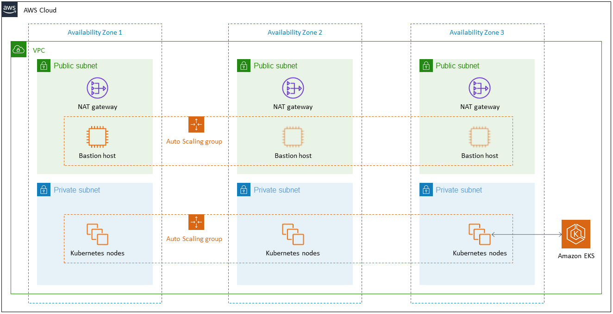

# VPC, Subnets and CIDR Ranges

This repository provides a task for applying knowledge gathered on VPC's, Subnets and CIDR ranges.

## Scenario

The diagram below shows a high level architecture for a [highly available](https://en.wikipedia.org/wiki/High_availability) Amazon Elastic Kubernetes Service (EKS) cluster.

At this stage you do not need to know anything about an EKS cluster, we'll be covering those later in the programme but instead let us focus on the networking aspects that you have covered so far. Those aspects of Regions, Availability zones, VPC and subnets.

You are going take the knowledge you have acquired so far and decide how you would configure the networks for this architecture.

The questions below will guide you through deciding how to setup the network.

## Questions

1. For now you can assume that all your customers are going to be located within the United Kingdom. What AWS region do you think your VPC should be set up in and why?

2. Now you have decided the AWS region it is time to move on to the availability zones. Which availability zones will you use? (Remember to check the diagram as well)

3. What IP range will you use for defining your VPC and why have you chosen that range?

   - 💡 Hint: You should specify a CIDR range for your VPC

4. Now you have your VPC range, it is time to define the subnets.
   - How many subnets do you require?
   - What IP range will you use for each subnet?
   - 💡 Hint: You might want to give each subnet a name that relates to its purpose and location

## Extension

Consider a scenario where we have customers all over Europe.

How do you think this might change our infrastructure?

## Advanced

Have a go at creating a VPC in the AWS console, without using the set up wizard available. See if you can get the following working;

- A VPC with 3 availability zones
- A public and private subnet for each of the availability zones
- Security groups which allow HTTP and HTTPS requests as Ingress (incoming) and all traffic as Egress (outgoing)
- An EC2 instance in one of the public subnets that you can SSH into

## Submission process

1. Use GitHub to [fork this repository](https://docs.github.com/en/get-started/quickstart/fork-a-repo)

2. Create a new file called SOLUTION.md

3. Outline your answers to each of the questions within the SOLUTION.md file

4. Commit and push the file back to your forked repository

5. Share your GitHub link to the repository
