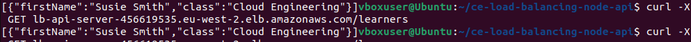

What endpoints and what request methods does the API currently support?

  Endpoints: / (get) , /learners (get), /learners (post) , /health-check (get)
 
Why do you think we use the port 3000 within the security group setup?

  I thought that it was so traffic circumnavigating the LB on port 80 won't work. So a direct api call to the
  servers will not return anything, suggesting that the querier uses the LB to make the requests.
  Also, could be better to utilize 2 security groups, one which allows 3000 only server side and one that allows 80 only on the LB.
  
  Also, a security by obscurity technique, less likely if public facing to be port scanned (typically standard ports are scanned). Though,
  you could argue any security advantage is questionable as it's public facing.

When setting up the ALB you had to specify a health check endpoint - why is that?

  So the LB knows which servers in the target group are up.

What is a load balancer and why might you use one?

  A physical or logical (software) device which shares traffic between separate servers.

Explain, in your own words, what security groups are?

  Essentially a firewalling technique to allow/block ports to a server which the security group is associated to.

Currently the application listens on port 3000, this isn't a standard HTTP port - what two ports would be better to use?

  80/443 (if using https)

When the API is deployed behind a load balancer, if you add multiple learners and then re-try GETting the learners, sometimes it shows the learners you have added other times it doesn't. Why is that?
  
  I expect that since each api server has it's own array of learners, when you attempt to get the learners, it's only returning with one server's worth
  of learners. It can't retrieve both learners arrays from both servers as it's configured round-robin, so will only hit one server.

Which bits of the setup do you think you could automate and why?

  Probably all of it, app config and install could be in userdata or as part of a custom AMI. Then the instances,LB, TG setup could be defined
  in a tool such as Cloudwatch or Terraform.

Add an image to the repository that shows your browser hitting the API and listing learners. Link that image within your SOLUTION.md markdown document
If you completed the extension exercise and used the AWS CLI to undertake the AWS actions, include a section called AWS Commands in your SOLUTION.md that outlines the commands you used

