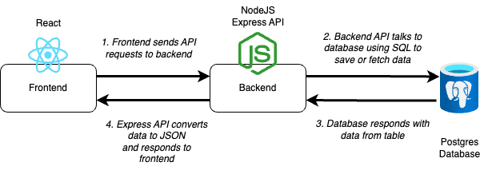

# ToDo List Project

In this project you are given a set of apps including a frontend, backend, and for the first time a database!

Your task as a cloud engineer is to get the applications all working happily together 🎉

## Architecture



The architecture above shows how the applications interact

### Frontend

The frontend is a React application.

It makes API calls to a backend API to save todo items and to read them back from the database.

### Backend

The backend is a Node ExpressJS API

It accepts:

- GET request to read todo items
- POST request to add new todo items

It saves and reads todo items in a Postgres Database

### Database

There is also a database directory that contains a Dockerfile for spinning up a Postgres database

## Instructions

The target goal for this project is to have the three applications deployed into your local Kubernetes cluster, deployed via Argo and bonus points for having them as Helm charts.

The steps from this point will provide you with a guide for breaking the task down as you iterate towards the final solution.

### Running locally

Don't worry about Kubernetes or deployment just yet.

Before trying to deploy things, you should get the applications running locally via Docker. This helps you to understand "what good looks like" before deploying things

To do this we've shared a handy new tool called [Docker Compose](https://docs.docker.com/compose/)

Docker compose allows you to define a file that will spin up multiple containers.

You can see the Docker compose definition in the [docker-compose.yml](./docker-compose.yml) file

To spin up all 3 applications, whilst in the root of this repository (where the docker-compose file is) run:

```
docker-compose up --build
```

You should then be able to open up the frontend by going to [localhost:8080](http://localhost:8080) but the API doesn't seem to be fetching items from the database. Seems like you might have to fix the end point - have a look through the code, debug on the browser and see if you can fix it it 💪🏽

### Container registry

Once you are happy with having the applications run locally, next its time to push those docker images to container registry.

**💡 HINT:** Make sure to have a read of the docker-compose file, it sets up some environment variables that will be required when you come to deploy the application. For example the backend API gets informed of the host that the database is living in. When deploying in Kubernetes, this will be different.

You will need to:

- Build a docker image for your frontend, backend and database
- Set up a public container registry for the frontend
- Set up a public container registry for the backend
- Set up a public container registry for your database

Once the registries are in place you'll need to push your 3 docker images (frontend, backend and database ) to your registry.

**BONUS POINTS:** If you do this via a CircleCI pipeline. Challenge here is that this repo contains multiple applications so is considered to be a "mono-repo" which makes it harder to setup things in CircleCI so maybe come back to this one if you have time.

### Manual deployment to Kubernetes

Next it's time to get things deployed on to your local cluster.

Within each of application directories you will see a kubernetes directory that contains empty service and deployment YAML files.

Your task is to complete those files and get the applications manually deployed using your `kubectl` command line

Once deployed, test your app and make sure it is all working

### Manual removal

Once you have verified that the applications are deploying manually ok then its time to remove them

Use `kubectl delete -f YAML_FILE` to remove each of the various deployments and services.

### Argo deployment

Time to go all GitOps 😍

Now install (if it isn't already) ArgoCD and setup your three applications using ArgoCD

### Helm

Now it is time to have a play with Helm. See if you can convert your applications to Helm charts.

Make sure to delete the application from ArgoCD before you attempt to re-create (the Helm version) in ArgoCD.

### Instrumentation and monitoring

As a final challenge, explore monitoring and instrumentation.

See if you can get prometheus running on your cluster and collecting metrics from your **backend** NodeJS API.

Try to also instrument your NodeJS code (the further reading section might help) and have those metrics exposed to Prometheus.

It would be great to see them visualised with Grafana dashboards too.

## Submission process

1. Fork this repository

2. Commit and push regularly

3. Complete the SOLUTION.md

4. Share the link to your repository

## Further reading

[Prometheus NodeJS client library](https://github.com/siimon/prom-client)

[NPM Package for prom-client](https://www.npmjs.com/package/prom-client)
